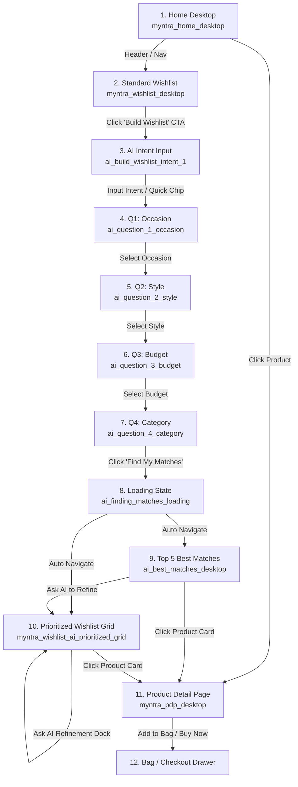

# UI Design & Screen Architecture Specification: Myntra AI Wishlist MVP

## 1. Executive Design Philosophy & Source of Truth

### 1.1 Visual Source of Truth
The UI screens extracted from **Stitch** located at `stitch_myntra_ai_wishlist_mvp/stitch_myntra_ai_wishlist_mvp/` are the **absolute visual and functional source of truth**. 
* **Design Rule:** The application must reproduce the exact layout, colors, typography, spacing, navigation, badges, product cards, and interaction states provided in the Stitch export.
* **Core Brand Identity:** Standard **Myntra** e-commerce experience (clean, white/off-white canvas, vibrant brand pink `#FF3F6C`, structured navigation, high-contrast imagery) with an elegant **AI layer** (`#7952FF` to `#FF3F6C` gradient accents, glassmorphism panels, and sparkling micro-animations).

---

## 2. Design System Tokens & Foundation

### 2.1 Color Palette

```
/* Primary & Brand Colors */
--color-primary: #b90041 / #FF3F6C          /* Myntra signature vibrant pink */
--color-primary-container: #df2457
--color-primary-fixed: #ffd9dc
--color-on-primary: #ffffff

/* AI Thematic Gradient */
--ai-gradient-start: #7952FF               /* Luminous Purple */
--ai-gradient-end: #FF3F6C                 /* Myntra Hot Pink */
--ai-gradient: linear-gradient(90deg, #7952FF 0%, #FF3F6C 100%)
--ai-bg-gradient: linear-gradient(135deg, rgba(121, 82, 255, 0.05) 0%, rgba(255, 63, 108, 0.05) 100%)
--ai-glass-bg: rgba(255, 255, 255, 0.75)

/* Neutral & Surface Tones */
--color-background: #f9f9ff / #ffffff
--color-bg-off-white: #F5F5F6
--color-surface: #f9f9ff
--color-surface-container-lowest: #ffffff
--color-surface-container-low: #f0f3ff
--color-surface-container: #e9eefb
--color-surface-container-high: #e4e8f5
--color-surface-variant: #dee2ef
--color-outline: #8f6f72
--color-outline-variant: #e3bdc0

/* Text & Feedback Colors */
--color-on-background: #171c25
--color-on-surface: #171c25
--color-secondary: #5a5d73                  /* Subtitles, secondary labels */
--color-on-surface-variant: #5b4042
--color-mrp-strikethrough: #94969F          /* Strike-through MRP */
--color-success-green: #03A685              /* Discounts, ratings, tags */
--color-error: #ba1a1a
```

### 2.2 Typography (`Hanken Grotesk` & Material Icons)

| Style Token | Size | Line Height | Weight | Tracking / Notes |
| :--- | :--- | :--- | :--- | :--- |
| `display-lg` | 48px | 56px | 800 (Extra Bold) | -0.02em tracking, AI titles |
| `headline-lg` | 32px | 40px | 700 (Bold) | Page headers, Wishlist titles |
| `headline-lg-mobile`| 24px | 30px | 700 (Bold) | Mobile hero / section titles |
| `title-md` | 20px | 28px | 600 (Semi Bold) | Card titles, modal headers |
| `body-lg` | 16px | 24px | 400 (Regular) | Primary text, descriptions |
| `body-sm` | 14px | 20px | 400 (Regular) | Secondary details, metadata |
| `label-bold` | 12px | 16px | 700 (Bold) | 0.05em tracking, buttons, badges |
| `price-main` | 16px | 1.0 | 700 (Bold) | Product selling price |
| `price-mrp` | 13px | 1.0 | 400 (Regular) | Strikethrough original MRP |

* **Icon Library:** Google `Material Symbols Outlined` (using `auto_awesome`, `favorite`, `shopping_bag`, `search`, `mic`, `check`, `arrow_back`, `star`, `close`, `send`).

### 2.3 Spacing & Layout Grid
* **Max Container Width:** `1280px` centered.
* **Desktop Grid Margins:** `40px` (`px-grid-margin-desktop`).
* **Mobile Grid Margins:** `16px` (`px-grid-margin-mobile`).
* **Grid Gutter:** `16px` to `24px` (`gap-gutter`).
* **Border Radii:** `rounded-DEFAULT` (0.125rem / 2px for buttons/cards), `rounded-lg` (0.25rem / 4px), `rounded-xl` (0.5rem / 8px), `rounded-2xl` (1rem / 16px), `rounded-full` (9999px for pills/chips).

---

## 3. Screen-by-Screen UI Specifications



---

### Screen 1: Home Desktop (`myntra_home_desktop`)
* **Role:** Authentic Myntra storefront discovery.
* **Header:**
  - Sticky white header (`h-20` desktop, `border-b border-surface-variant`).
  - Myntra logo in signature `#b90041` / `#FF3F6C`.
  - Primary category links: **MEN**, **WOMEN**, **KIDS**, **HOME & LIVING**, **BEAUTY**, **STUDIO** (with red `NEW` superscript).
  - Search bar with pill shape, search icon, and voice search mic icon.
  - Action icons: Profile, Wishlist (with active badge count), Shopping Bag.
* **Content Canvas:**
  - Promo banner carousel with seasonal offers.
  - Curated category quick tiles (Ethnic Wear, Western Wear, Footwear, Watches, Beauty).
  - Product recommendation grid with standard 4-column e-commerce cards.
  - Hover states on cards revealing "WISHLIST" and quick size select actions.

---

### Screen 2: Standard Wishlist Desktop (`myntra_wishlist_desktop`)
* **Role:** Baseline Myntra wishlist displaying saved products before AI intervention.
* **Header Bar:**
  - `My Wishlist` (`headline-lg`) with item count (e.g. `19 items`).
  - Sort dropdown: `Sort by: Latest Added`, `Price: Low to High`, `Price: High to Low`, `Discount`.
* **Marquee AI Banner ("Make your wishlist work for you"):**
  - Frosted glass container (`ai-glass`, `rounded-xl`, `border-tertiary-fixed-dim`).
  - Icon: Sparkle `auto_awesome` in gradient fill.
  - Heading: `Make your wishlist work for you` with gradient text.
  - Subtitle: *"Tell us what you're shopping for and we'll find the most relevant items from your wishlist."*
  - CTA Button: `Build Wishlist` (`ai-gradient-bg`, text white, `rounded-DEFAULT`, hover opacity transition).
* **Product Grid:**
  - 4-column grid (`gap-gutter`).
  - Standard product card: 3:4 aspect image, close (remove) button at top-right, Brand name, Title, Price, Strike MRP, Discount % badge.
  - On hover: Slide-up `MOVE TO BAG` primary button.

---

### Screen 3: Build Wishlist Intent Modal (`ai_build_wishlist_intent_1` & `_2`)
* **Role:** First step of AI interaction for natural-language intent capture.
* **Layout:** Centered modal/card overlay (`max-w-2xl`, `ai-glass-panel`, `rounded-xl`, `p-8 md:p-12`) over subtle animated gradient backdrop.
* **UI Elements:**
  - AI Stylist chip with sparkling icon.
  - Heading: `Build your wishlist` (`display-lg`), Subtitle: `What are you shopping for?`
  - Textarea (`rows="3"`, inner shadow, placeholder: *"e.g. I need something for my friend's wedding..."*).
  - Mic icon for voice input.
  - Character counter: `0/150 characters`.
  - **Quick Suggestions Chips:**
    - `Wedding`, `Vacation`, `Work`, `Birthday / Gift`, `Party`, `Something else ✏️`.
  - **Action Button:** Full-width `Continue` button with forward arrow (disabled until user inputs text or selects a chip, turns active Myntra Pink on input).

---

### Screen 4: Question 1 — Occasion (`ai_question_1_occasion`)
* **Role:** Sequential AI questionnaire step 1.
* **Header & Progress:**
  - Top bar with `Back` button, centered `AI Match ✨` title, and horizontal 25% progress bar.
  - Step indicator: `Step 1 of 4` (left), `Personalizing ✨` (right).
* **Question Prompt:**
  - Title: `What's the occasion?` (`display-lg`).
  - Subtitle: `Select an event to help us tailor your AI recommendations.`
* **Options Grid (2x3 Bento Grid):**
  - **Cards:** `Wedding` (favorite icon), `Party` (celebration icon), `Work` (work icon), `Vacation` (flight icon), `Casual` (coffee icon), `Other` (more_horiz icon).
  - **Selected State:** Border highlight, active icon background, visible checkmark badge at top-right.
* **Bottom Bar:** Sticky footer with `Back` and `Continue` buttons.

---

### Screen 5: Question 2 — Style (`ai_question_2_style`)
* **Role:** Sequential AI questionnaire step 2.
* **Progress:** 50% filled progress bar (`Step 2 of 4`).
* **Question Prompt:**
  - Title: `What's your preferred style?`
  - Subtitle: `Choose an aesthetic that matches what you have in mind.`
* **Options Grid (Image-rich Visual Cards):**
  - **Cards with rich editorial photography:**
    1. `Elegant` (Sophisticated & Timeless)
    2. `Minimal` (Clean & Simple Lines)
    3. `Trendy` (Bold & Current)
    4. `Traditional` (Classic Ethnic Wear)
    5. `Casual` (Relaxed & Everyday)
  - **Interaction:** Full image card with bottom gradient overlay, checkmark radio icon at top-right, border glow on hover/selection.

---

### Screen 6: Question 3 — Budget (`ai_question_3_budget`)
* **Role:** Sequential AI questionnaire step 3.
* **Progress:** 75% filled progress bar (`Step 3 of 4`).
* **Question Prompt:**
  - Title: `What's your budget?`
  - Subtitle: `We'll tailor recommendations to fit your spending style.`
* **Options List (Horizontal Glass Panels):**
  - `Under ₹2,000`
  - `₹2,000 – ₹5,000`
  - `₹5,000 – ₹10,000`
  - `₹10,000+`
  - **Selection State:** Gradient background tint, glowing border, checkmark icon activation.

---

### Screen 7: Question 4 — Category (`ai_question_4_category`)
* **Role:** Sequential AI questionnaire step 4.
* **Progress:** 100% filled progress bar (`Step 4 of 4`).
* **Question Prompt:**
  - Title: `What are you looking for?`
  - Subtitle: `Select a category to help us tailor your recommendations.`
* **Options Grid:**
  - `Ethnic Wear` (Lehengas, Sarees, Kurtas)
  - `Western Wear` (Dresses, Jumpsuits, Co-ords)
  - `Footwear & Heels`
  - `Accessories & Bags`
  - `All Categories` (Look across everything saved)
* **Action Button:** `Find My Matches ✨` (prominent button triggering loading animation).

---

### Screen 8: AI Finding Matches Loading (`ai_finding_matches_loading`)
* **Role:** Engaging AI processing interstitial.
* **Visual Styling:**
  - Subtle background dim with diagonal gradient bloom (`#7952FF` to `#FF3F6C`).
  - Centered frosted glass container with glowing shimmer sweep.
  - **Animation:** Dual orbital ping rings, rotating gradient mesh backdrop (`animate-spin-slow`), and central pulsing `auto_awesome` icon.
  - **Text:**
    - `✨ Finding your best matches` (`title-md`)
    - `Looking through your 19 saved items in Wishlist...` (`body-sm`)
  - **Progress Bar:** Smooth infinite gradient shimmer bar.
  - **Timing:** 1.2 to 2.0 second delay before seamless transition to results.

---

### Screen 9: Top 5 Best Matches View (`ai_best_matches_desktop`)
* **Role:** Curated highlight view of the top recommendations.
* **Header & Criteria Chip:**
  - Title: `Your Best Matches` (`display-lg`).
  - Active Filter Pill: `Based on: Wedding • Elegant • ₹5,000–₹10,000 ✨` (lavender pill with border).
* **Bento Grid Layout:**
  - **#1 Top Match (Hero 12-column horizontal card):**
    - Left (35%): Large high-res editorial product image with `98% Match ✨` badge.
    - Right (65%): Brand (`Manyavar Mohey`), Product Title (`Dusty Rose Embroidered Silk Lehenga`), Pricing (`₹8,999` with strike MRP & 40% OFF badge).
    - **"Why this is your top match" Box:** Light container with 3 verified green checks:
      - *Fits your budget perfectly (₹5k–10k)*
      - *Matches your style (Elegant minimalist embroidery)*
      - *Suitable for occasion (Classic wedding ceremony silhouette)*
    - Full-width `View Product Details` primary button.
  - **Matches #2, #3, #4, #5 (4-column vertical grid cards):**
    - Aspect 3:4 image with `94% Match`, `91% Match`, `88% Match` pills.
    - Brand, title, price, discount.
    - Compact "Why it matches" bullet points with green checkmarks.
    - `View Product` action button.

---

### Screen 10: Unified Prioritized Wishlist Grid (`myntra_wishlist_ai_prioritized_grid`)
* **Role:** The entire user wishlist ordered strictly by relevance score.
* **Header & Summary Stats:**
  - Header: `Your Wishlist, prioritized for you ✨`
  - Subtitle: *"Based on your answers, we've ranked your saved items by how relevant they are right now."*
  - Context Chips: `Wedding ✕`, `Elegant ✕`, `₹5,000–₹10,000 ✕`, `+ Add Filter`.
  - Summary Bar: `19 items • Based on: Wedding • Elegant • ₹5k–10k • Sorted by: ✨ Relevance`.
* **Unified Product Grid (5 columns on desktop):**
  - **No arbitrary section dividers** (no "Best", "Good", "Bad" buckets).
  - Every product card features:
    - **Match % Badge at top-left:** `98% Match`, `94% Match`, `87% Match`, `64% Match`, `42% Match`.
    - **Info Tooltip / Popover on hover:** Shows *"Why this matches: ✓ Suitable for wedding ✓ Within budget"*.
    - Standard Myntra card details (Brand, Title, Price, MRP, Discount %, Favorite toggle).

---

### Screen 11: Ask AI Refinement Docked Widget
* **Role:** Persistent conversational refinement tool.
* **Positioning:** Fixed floating docked pill widget at the bottom center of the screen (`z-40`, `max-w-[600px]`, `glass-panel`, `rounded-2xl`, `shadow-2xl`).
* **Elements:**
  1. Header/Input: Sparkle avatar, input field (`"Want to refine these? Ask AI..."`), Send icon button.
  2. **Quick Refinement Chips (Horizontally Scrollable):**
     - `✨ Show me only dresses`
     - `Remove anything over ₹5,000`
     - `I want something less flashy`
     - `Change to pastel colors`
     - `Find best value`
* **Behavior:** On chip click or custom text submission, triggering real-time re-ranking with smooth card reordering transitions.

---

### Screen 12: Product Detail Page (`myntra_pdp_desktop`)
* **Role:** Full Myntra PDP for product selected from recommendations.
* **Layout (2-Column Desktop Grid):**
  - **Left (58%):** 2x2 Image gallery with high-res zoomable product photography.
  - **Right (42%):** Sticky product buy-box:
    - Brand (`Sera`), Title (`Women Crimson Solid Satin Maxi Evening Gown`).
    - Rating Pill: `4.2 ★` (green badge) + `| 1.2k Ratings`.
    - Price: `₹2,499` with `MRP ₹5,999` and `(58% OFF)` tag, *"inclusive of all taxes"*.
    - **AI Context Card:** Light lavender frosted card with `auto_awesome` icon:
      - Title: `Why you might like this`
      - Points: *"Perfect match for 'evening weddings' based on your recent search"*, *"Premium satin fabric offers a luxurious drape"*.
    - **Size Selector:** Circular buttons (`S`, `M` selected with thick pink border, `L`, `XL` strike-through/disabled), Size Chart link.
    - **Action Buttons:** `ADD TO BAG` (`#FF3F6C` hot pink button with shopping bag icon), `BUY NOW` (dark button).

---

## 4. Key UI Components & Behavioral States

### 4.1 Product Card States

```
+------------------------------------+
| [ 98% Match (i) ]          [ (♥) ] |   <-- Match Badge (top-left), Wishlist toggle (top-right)
|                                    |
|                                    |
|             PRODUCT                |
|              IMAGE                 |
|             (3:4)                  |
|                                    |
| [  MOVE TO BAG (On Hover)        ] |   <-- Slide-up action on hover
+------------------------------------+
| MANGO                              |   <-- Brand (Bold 12px uppercase)
| Emerald Silk Wrap Maxi Dress       |   <-- Title (14px truncate)
| ₹5,999  ₹9,999  (40% OFF)          |   <-- Selling price, MRP, Discount
+------------------------------------+
```

### 4.2 AI Match Badge & Tooltip Popover
* **Visual:** Frosted white/lavender pill with bold pink text `98% Match` and `info` icon.
* **Popover:** Hovering over the badge renders a floating tooltip with attribute validations:
  - `✓ Fits your ₹5,000–₹10,000 budget`
  - `✓ Matches Wedding occasion`
  - `✓ Elegant aesthetic with silk fabric`

### 4.3 Docked "Ask AI" Refinement Widget States
* **Idle:** Frosted pill floating at bottom center with prompt placeholder and suggested chips.
* **Active Input:** Focus ring in `#7952FF`, send button activates.
* **Submitted Query:** Brief pulse / shimmer animation on the wishlist grid as items reorder into updated rank order.

---

## 5. Responsive Breakpoint Rules

| Breakpoint | Wishlist Grid | Top 5 Match Layout | AI Questionnaire | PDP Layout |
| :--- | :--- | :--- | :--- | :--- |
| **Desktop (`>=1024px`)** | 4–5 Columns | 12-col Hero + 3x4-col Grid | Centered modal (max-w-3xl) | 2-Column Side-by-Side (Sticky Details) |
| **Tablet (`768px - 1023px`)**| 3 Columns | Stacked Hero + 2-col Grid | Full screen overlay | 2-Column with scrolling gallery |
| **Mobile (`<768px`)** | 2 Columns | Vertical Cards Stack | Full screen with bottom buttons | 1-Column Stack + Fixed Bottom Buy Bar |

---

## 6. Implementation Checklist for UI Parity

- [x] Integrate exact color tokens from Stitch (`#FF3F6C`, `#7952FF`, `#171c25`, `#dee2ef`, `#03A685`).
- [x] Load `Hanken Grotesk` font family and `Material Symbols Outlined`.
- [x] Match desktop top navigation with exact Myntra menu tabs and search input.
- [x] Replicate the AI Wishlist banner card with gradient text and sparkling icons.
- [x] Implement the 4-step AI question flow with progressive stepper and visual cards.
- [x] Implement orbital ring loading animation for the "Finding Matches" state.
- [x] Build Bento layout for "Your Best Matches" (Hero card + Top matches).
- [x] Build Unified Prioritized Wishlist Grid showing individual % match badges on all cards.
- [x] Build docked "Ask AI" refinement bar with quick chips and custom prompt input.
- [x] Build Product Detail Page with image gallery, size selector, AI context box, and Bag actions.
