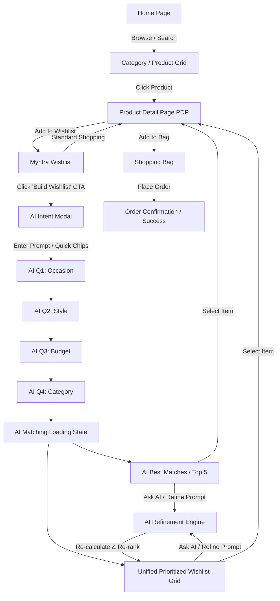

# Project Context & Specifications: Myntra AI-Powered Wishlist MVP

## 1. Project Overview & Core Identity

### 1.1 Product Statement
This project is an **exact functional MVP of the Myntra web/desktop application** enhanced with a single new marquee feature: **AI-Powered Wishlist Prioritization**.

> **Guiding Principle:**
> *"Myntra launches an AI-powered Wishlist feature."*
> 
> This is **NOT** a new wishlist standalone app, an AI shopping assistant chat interface, or a reimagined marketplace. It is the authentic Myntra experience, preserving all standard e-commerce flows (Browse, Search, Product Details, Add to Wishlist, Add to Bag, Checkout), with an intelligent AI layer seamlessly integrated into the existing Wishlist.

### 1.2 The Problem
Active Myntra users maintain extensive wishlists (often dozens of items accumulated over time). When a specific shopping need arises (e.g., *"I need an outfit for my friend's destination wedding under ₹5,000"*), users face decision paralysis. Sifting through a large, unstructured wishlist to find items matching the immediate occasion, style, budget, and availability requires tedious manual re-evaluation.

### 1.3 The Solution
An AI layer embedded directly within the existing Myntra Wishlist:
1. **Captures Immediate Intent:** Users click **"Build Wishlist"** and express their current need via natural language or quick prompts.
2. **Contextual Dialogue:** A short, intelligent multi-step question flow clarifies occasion, style, budget, and categories.
3. **Wishlist Prioritization Engine:** Evaluates **only the user's existing saved wishlist items** against structured attributes, calculating a precise individual relevance percentage (e.g., 94% Match) and explainable reasons.
4. **Unified Prioritized View & Top 5 Recommendations:** Displays the sorted wishlist with match badges, detailed match explanations, and dynamic conversational refinement ("Ask AI").
5. **Direct Path to Purchase:** Seamless transition to the standard Myntra Product Display Page (PDP), Bag, and Checkout.

---

## 2. Design System & UI Source of Truth

### 2.1 UI is Locked (Stitch Specification)
The screens generated in the provided **Stitch UI export** (`stitch_myntra_ai_wishlist_mvp/`) represent the absolute source of truth for visual design, layout, styling, and typography.
* **No Redesigns:** Do not change colors (Myntra pink `#ff3f6c`, dark text `#282c3f`, grey borders `#eaeaec`, etc.), typography (Whitney / Assistant / Inter / system sans-serif), spacing, card proportions, or navigation patterns.
* **Component Fidelity:** Match standard Myntra headers (sticky navbar with Logo, Men, Women, Kids, Home & Living, Beauty, Studio, Search bar, Profile, Wishlist, Bag icons), breadcrumbs, product tiles, badges, and modals.

### 2.2 Screen Inventory & Asset Mapping
The Stitch assets located in `stitch_myntra_ai_wishlist_mvp/stitch_myntra_ai_wishlist_mvp/` map directly to application views:

| Screen Folder | Purpose & Role in App |
| :--- | :--- |
| `myntra_home_desktop` | Standard Myntra Homepage with banners, category navigation, trending carousels, and product discovery grids. |
| `myntra_wishlist_desktop` | Standard Myntra Wishlist grid with item count, product cards with remove/move-to-bag actions, and the **"Build Wishlist"** AI CTA banner/button. |
| `ai_build_wishlist_intent_1` / `_2` | Intent capture modal/screen with natural-language text input ("Tell AI what you need...") and quick-select intent chips. |
| `ai_question_1_occasion` | Contextual question step 1: Occasion selection (e.g., Wedding, Casual, Party, Work, Vacation). |
| `ai_question_2_style` | Contextual question step 2: Style preferences (e.g., Traditional, Modern Chic, Minimalist, Bold). |
| `ai_question_3_budget` | Contextual question step 3: Budget range slider / tiered pills (e.g., Under ₹2,000, ₹2,000–₹5,000, ₹5,000+). |
| `ai_question_4_category` | Contextual question step 4: Focus categories / item types (e.g., Ethnic Wear, Dresses, Footwear, Accessories). |
| `ai_finding_matches_loading` | Animated AI processing / matching screen ("Analyzing your wishlist items against your requirements..."). |
| `ai_best_matches_desktop` | Top 5 Curated Recommendations view showing highest scoring wishlist items with match rationale. |
| `myntra_wishlist_ai_prioritized_grid` | Unified Wishlist view re-ranked from highest to lowest match %, displaying individual match badges and "Why this matches" accordions/drawers. |
| `myntra_pdp_desktop` | Complete Myntra Product Detail Page with image gallery, pricing/discounts, size selector, delivery check, product details, and Add to Bag / Wishlist CTAs. |
| `myntra_ai_wishlist_full_flow` | End-to-end composite reference of the complete user interaction flow. |

---

## 3. End-to-End User Journeys



### 3.1 Flow A: Standard Myntra Shopping Flow
1. **Home / Discovery:** User explores curated feeds, banners, and categories.
2. **Product Browsing:** User views product cards with brand, title, pricing, discount, and ratings.
3. **PDP:** User inspects images, selects sizes (XS, S, M, L, XL), reviews specifications.
4. **Wishlist Management:** User adds/removes items to/from Wishlist with persistent state.
5. **Bag & Checkout:** User adds items with selected size to Bag, modifies quantities, and completes simulated purchase.

### 3.2 Flow B: AI Wishlist Prioritization Flow
1. **Entry:** User navigates to Wishlist containing 15–25 saved items.
2. **Initiate:** User clicks the **"Build Wishlist"** AI banner/button.
3. **Intent Input:** User types freeform text (e.g., *"Looking for an elegant pastel lehenga or anarkali for a day wedding"*) or picks a quick preset.
4. **AI Dialogue:** System responds with 3–4 tailored multiple-choice clarifying questions (Occasion, Style, Budget, Product Type).
5. **Scoring Engine:** The engine evaluates every item in the user's wishlist across weighted attributes and assigns an individual match percentage (0% to 100%).
6. **Top 5 & Unified Prioritized Grid:**
   - **Top 5 View:** Highlights the 5 highest scoring items with explicit "Why this matches" breakdown.
   - **Unified Grid:** The complete wishlist is presented in descending order of relevance, with clear match % badges on each card.
   - *Constraint:* Never segment into arbitrary tier buckets (e.g. "90%+ Bucket"). Keep it as one cohesive Myntra grid.
7. **Ask AI / Refinement:** User inputs follow-up refinements (e.g., *"Show me options under ₹3,500 only"* or *"Something more breathable for outdoor afternoon"*). The engine immediately re-ranks the existing wishlist.
8. **Action:** User selects the top match, opens PDP, selects size, and adds to Bag.

---

## 4. System Architecture & Module Boundaries

The application is structured with strict modularity so that the mock intelligence layer can seamlessly be replaced with real LLM/API endpoints without touching UI components:

```
src/
├── data/
│   ├── products.json / mockProducts.ts    # 15-25 rich mock products with structured attributes
│   └── intentPresets.ts                   # Sample prompts, intent chips, and default options
├── store/ / state/
│   ├── WishlistContext.tsx / store.ts     # Persistent wishlist items, add/remove actions
│   ├── CartContext.tsx / store.ts         # Persistent Bag/Cart items, quantities, size choices
│   └── AiWishlistContext.tsx / store.ts   # Active intent, Q&A responses, refinement state, scores
├── engine/
│   ├── scorer.ts                          # Deterministic scoring algorithm & attribute matching
│   ├── explanationGenerator.ts            # "Why this matches" attribute breakdown generator
│   └── refinementHandler.ts               # Prompt-to-filter/re-ranking parser
├── components/
│   ├── common/                            # Header, Footer, Breadcrumbs, Badges, Toast, Rating
│   ├── home/                              # Home hero banners, category tiles, curated grids
│   ├── wishlist/                          # Standard Wishlist grid, item cards, remove actions
│   ├── ai-flow/                           # Intent modal, question steps, loading animation
│   ├── ai-results/                        # Top 5 best matches, match % pill, "Why this matches" drawer
│   ├── pdp/                               # Image gallery, size selector, action buttons
│   └── bag/                               # Cart summary, price breakdown, promo code, checkout
└── pages/ / routes/
    ├── HomePage
    ├── WishlistPage
    ├── PDPPage
    └── BagPage
```

---

## 5. Data Models & Metadata Specifications

### 5.1 Product Schema
Every product requires comprehensive structured metadata to enable granular, explainable AI scoring:

```typescript
export interface Product {
  id: string;
  brand: string;
  title: string;
  description: string;
  category: 'Men' | 'Women' | 'Kids' | 'Footwear' | 'Accessories';
  subCategory: 'Ethnic Wear' | 'Western Wear' | 'Dresses' | 'Kurtas' | 'Shirts' | 'Trousers' | 'Shoes' | 'Bags';
  price: number;
  originalPrice: number;
  discountPercentage: number;
  rating: number;
  ratingCount: number;
  images: string[];
  sizes: ('XS' | 'S' | 'M' | 'L' | 'XL' | 'XXL' | string)[];
  inStock: boolean;
  
  // Structured Metadata for AI Matching
  attributes: {
    occasions: ('Wedding' | 'Cocktail' | 'Casual' | 'Work / Formal' | 'Party / Festive' | 'Vacation / Resort' | 'Daily Wear')[];
    styles: ('Traditional' | 'Contemporary' | 'Minimalist' | 'Boho' | 'Classic' | 'Glamorous' | 'Sporty' | 'Chic')[];
    color: string;
    colorFamily: 'Pastel' | 'Dark' | 'Bright' | 'Neutral' | 'Metallic';
    fabric: string;
    fit: 'Slim' | 'Regular' | 'Relaxed' | 'Oversized' | 'Tailored';
    season: 'Summer' | 'Winter' | 'All Season' | 'Festive Season';
    formality: 'Ultra Formal' | 'Semi-Formal' | 'Casual' | 'Smart Casual';
    tags: string[];
  };
}
```

### 5.2 User Intent & AI State Schema

```typescript
export interface UserIntent {
  rawPrompt: string;
  occasion?: string;
  style?: string[];
  budgetMax?: number;
  preferredCategories?: string[];
  colorPreference?: string[];
  additionalConstraints?: string[];
}

export interface MatchResult {
  productId: string;
  matchScore: number;         // Integer percentage 0 - 100%
  rank: number;
  matchReasons: string[];     // e.g. ["Fits within ₹5,000 budget", "Matches Wedding guest occasion", "Pastel silk fabric matches style"]
  mismatchNotes?: string[];   // e.g. ["Dry clean only"]
}
```

---

## 6. Recommendation & Scoring Algorithm

The scoring engine must be **deterministic, explainable, and responsive to updates**:

### 6.1 Weight Distribution
1. **Occasion Match (35%):** Exact match with target occasion gives full score; related occasion gives partial credit.
2. **Style & Aesthetics Match (25%):** Overlap between preferred styles/tags and product attributes.
3. **Budget Compliance (20%):**
   - `price <= budgetMax`: 100% score for this component.
   - `price > budgetMax`: Scaled down linearly; heavy penalty if > 20% over budget.
4. **Category / Sub-category Fit (15%):** Direct match with user's desired category.
5. **Color & Fabric Synergy (5%):** Preferred color tones/families.

### 6.2 Formula
$$\text{Score} = (W_{occ} \cdot S_{occ}) + (W_{style} \cdot S_{style}) + (W_{budget} \cdot S_{budget}) + (W_{cat} \cdot S_{cat}) + (W_{attr} \cdot S_{attr})$$

Normalized to an integer percentage **(e.g., 94%)**.

### 6.3 Explainability Generator
For each product, generate 2–4 concise bullet points from the highest matching attribute dimensions:
* *"Fits your ₹5,000 budget (₹4,299)"*
* *"Perfect for Evening / Cocktail occasions"*
* *"Features your preferred Minimalist Chic aesthetic"*
* *"Crafted from breathable Georgette fabric"*

---

## 7. AI Refinement Engine ("Ask AI")

When viewing the prioritized wishlist, users can issue conversational refinements:
* **"Show me only traditional ethnic wear"** $\rightarrow$ Re-scores with heavy ethnic category filter.
* **"Find options under ₹3,000"** $\rightarrow$ Updates `budgetMax` to 3000 and re-calculates scores.
* **"Which one is best for day wear?"** $\rightarrow$ Shifts occasion weight to day/casual/pastel.
* **"Show me bolder colors"** $\rightarrow$ Boosts bright/vibrant color family matches.

The engine dynamically recalculates and animates the re-ordered wishlist cards in real time.

---

## 8. Development Phases & Implementation Sequence

1. **Step 1: UI Foundation & Design System Alignment**
   - Integrate Stitch CSS/styles, Myntra typography, icon sets, color palette, and layout wrappers.
   - Ensure sticky navigation bar with search, category tabs, and header icons (Profile, Wishlist, Bag).
2. **Step 2: Mock Dataset & State Management**
   - Seed 20+ realistic fashion products across Men's & Women's Ethnic, Western, Footwear, and Accessories with rich metadata.
   - Initialize `WishlistContext` with ~15 pre-wishlisted items.
   - Initialize `CartContext` for Bag management.
3. **Step 3: Core Myntra Views**
   - Build **Home Page** with banner carousels and product discovery sections.
   - Build **Product Detail Page (PDP)** with image zoom/gallery, size selector, price calculation, and Wishlist/Bag actions.
   - Build **Bag / Checkout Modal** showing item summary and subtotal.
4. **Step 4: Standard Wishlist View**
   - Render the baseline Myntra Wishlist grid with item count, pricing, remove item CTA, and move to bag CTA.
   - Add prominent **"Build Wishlist"** AI header CTA card matching the Stitch design.
5. **Step 5: AI Wishlist Flow (Modal & Step-by-Step Questionnaire)**
   - Modal for initial intent input (Text box + Quick prompt chips).
   - 4-step interactive question flow (Occasion, Style, Budget, Category).
   - Polished AI loading screen ("Analyzing saved items...").
6. **Step 6: Scoring Engine & Prioritized Wishlist Views**
   - Implement deterministic multi-attribute scoring algorithm.
   - Implement **Top 5 Best Matches** curated view with match badges and breakdown.
   - Implement **Unified Prioritized Wishlist Grid** sorted by match score.
   - Add "Why this matches" popover/drawer on product cards.
7. **Step 7: "Ask AI" Conversational Refinement**
   - Add chat/refine input bar on the prioritized wishlist screen.
   - Implement prompt parser that modifies scoring weights and re-ranks items dynamically.
8. **Step 8: End-to-End Verification & Polish**
   - Validate full flow from Home $\rightarrow$ Wishlist $\rightarrow$ Build Wishlist $\rightarrow$ Questions $\rightarrow$ Re-ranked Grid $\rightarrow$ Refine $\rightarrow$ PDP $\rightarrow$ Bag $\rightarrow$ Checkout.
   - Ensure complete visual fidelity with all Stitch screens.

---

## 9. Verification & Acceptance Checklist

| Requirement | Acceptance Criteria |
| :--- | :--- |
| **Look & Feel** | Exact Myntra branding, layout, fonts, colors, and header/footer navigation. Matches Stitch UI screens. |
| **Mock Products** | 15–25 comprehensive products with full metadata attributes (occasion, style, fabric, budget, etc.). |
| **Wishlist State** | Persists additions, removals, and transitions across all views. |
| **AI Entry Point** | "Build Wishlist" CTA clearly visible in Wishlist and opens intent dialogue. |
| **Question Flow** | Contextual multi-step questions (Occasion, Style, Budget, Category) with smooth transitions. |
| **Scoring Authenticity** | Every saved item receives a distinct, data-backed match % (e.g. 94%, 88%, 73%). No hardcoded dummy rankings. |
| **Wishlist Constraint** | Only ranks **existing saved wishlist items**; does not pull random external products. |
| **Unified Grid** | Single sorted grid with match % badges; no arbitrary section bucket splits. |
| **Match Reasons** | Clear, attribute-grounded "Why this matches" explanations for recommended items. |
| **Ask AI Refinement** | Text-based refinement modifies scoring and updates wishlist order in real time. |
| **Full Navigation** | Clicking recommended card navigates seamlessly to correct PDP with size selection and Add to Bag. |
| **Bag & Purchase** | Products can be added to Bag from PDP/Wishlist and purchased in checkout flow. |
